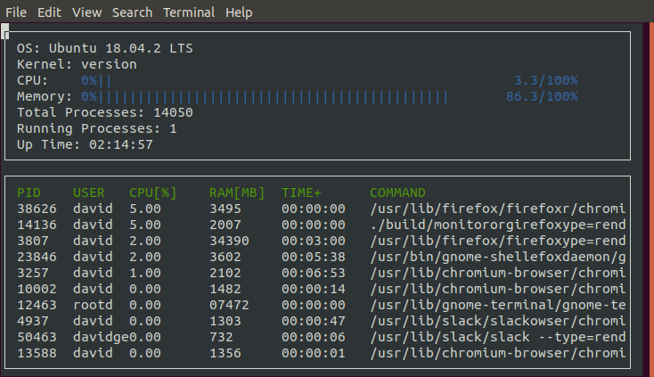

# CppND-System-Monitor
This project implements a process manager for the Linux operating system, similar to htop. Linux stores information about those processes in a couple of files. The program reads those files, extracts the required values, formats them and uses Ncurses to display them inside the console.




## ncurses
[ncurses](https://www.gnu.org/software/ncurses/) is a library that facilitates text-based graphical output in the terminal. This project relies on ncurses for display output.

Within the Udacity Workspace, `.student_bashrc` automatically installs ncurses every time you launch the Workspace.

If you are not using the Workspace, install ncurses within your own Linux environment: `sudo apt install libncurses5-dev libncursesw5-dev`

## Make
This project uses [Make](https://www.gnu.org/software/make/). The Makefile has four targets:
* `build` compiles the source code and generates an executable
* `format` applies [ClangFormat](https://clang.llvm.org/docs/ClangFormat.html) to style the source code
* `debug` compiles the source code and generates an executable, including debugging symbols
* `clean` deletes the `build/` directory, including all of the build artifacts

## Instructions
1. Clone repository
```
git clone https://github.com/udacity/CppND-System-Monitor
```
2. Follow along with the lesson and make sure you complete the `ProcessParser` and `Process` classes before attempting to run the project.

3. Install `ncurses` package
```
sudo apt-get install libncurses5-dev libncursesw5-dev
```
4. Compile and run
```
g++ -std="c++17" main.cpp -lncurses
./a.out
```
5. In case of error that looks like the following: 
```
root@77e30fca8a01:/home/workspace/CppND-Object-Oriented# ./a.out
*** %n in writable segment detected ***
                                      Aborted (core dumped)
```
just keep trying `./a.out` and it should work eventually!
